<!-- ANIMATED HEADER — dark/light mode responsive -->
<picture>
  <source media="(prefers-color-scheme: dark)" srcset="./header-dark.svg">
  <source media="(prefers-color-scheme: light)" srcset="./header-light.svg">
  
</picture>

<div align="center">

<br>

<!-- TYPING ANIMATION -->
<a href="https://avelyxstudio.ch">

</a>

<br>

[`avelyxstudio.ch`](https://avelyxstudio.ch)&#8287;&#8287;·&#8287;&#8287;[`info@avelyxstudio.ch`](mailto:info@avelyxstudio.ch)

</div>


<div align="center">

<br>

I build AI systems that generate production-ready websites, automate cloud infrastructure, and trade markets.

<br><br>


<br><br>


<br>

<br>


<br><br>


<br>

</div>


<br>

<div align="center">

**`>_ what I build`**

</div>

<br>

<div align="center">
<picture>
  <source media="(prefers-color-scheme: dark)" srcset="./projects.svg">
  <source media="(prefers-color-scheme: light)" srcset="./projects-light.svg">
  
</picture>
</div>

<br>


<br>

<div align="center">

**`>_ system monitor`**

<br>

<picture>
  <source media="(prefers-color-scheme: dark)" srcset="./terminal-dark.svg">
  <source media="(prefers-color-scheme: light)" srcset="./terminal-light.svg">
  
</picture>

</div>

<br>


<br>

<div align="center">

<picture>
  <source media="(prefers-color-scheme: dark)" srcset="https://raw.githubusercontent.com/avelyx/avelyx/snake/github-snake-dark.svg" />
  <source media="(prefers-color-scheme: light)" srcset="https://raw.githubusercontent.com/avelyx/avelyx/snake/github-snake.svg" />
  
</picture>

<br><br>


<br><br>

```
ship fast · design slow · think different
```

<br>


</div>
